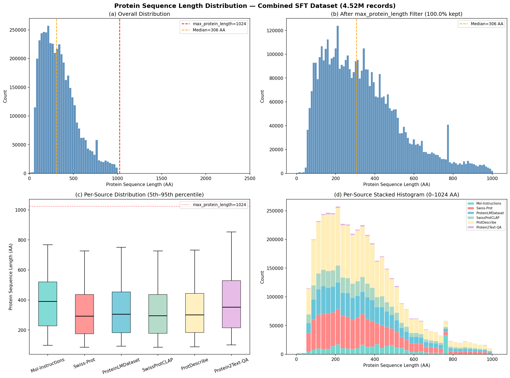

# Combined SFT Dataset Quality Audit

**Directory**: `data/processed/combined_sft_260225/`
**Date**: 2026-02-25
**Total Files**: 20 JSON files (+ `assembly_manifest.json`)
**Total Records**: 4,715,925

---

## 1. Executive Summary

| Verdict | Details |
|---------|---------|
| **Schema** | **PASS** — All 20 files have correct `{instruction, input, output}` keys |
| **Sequence Format** | **PASS** (19/20) — All non-design files use backtick-wrapped sequences. `mol_protein_design.json` has text input (excluded by config) |
| **Sequence Extraction** | **PASS** — `_extract_protein_sequence()` can parse 100% of inputs (excluding design) |
| **Short Outputs** | **WARNING** — 6 files have outputs < 10 chars (single-word annotations like "Monomer.", "Secreted."). Biologically correct but may bias the model toward terse responses |
| **Duplicates** | **WARNING** — 12-16% within-file duplicate rate in ProtDescribe, ProteinLM, and SwissProtCLAP. Caused by same protein annotated across instruction template variants |
| **Cross-Source Overlap** | **CONCERN** — 72.8% of unique sequences appear in 3+ sources (all derive from UniProt). Different tasks per source, but same proteins seen repeatedly |
| **Instruction Diversity** | **MODERATE** — Most files use 5-12 templates. Only `p2t_protein_qa.json` has truly diverse instructions (44,915 unique) |

**Overall**: The data is **usable for SFT as-is**, but deduplication and short-output filtering would improve training quality. No format-level blocking issues.

---

## 2. Per-File Detailed Report

### Legend
- Record Count / Seq Extraction / Backtick Format / Duplicates / Short Outputs / Instruction Templates

### 2.1 Mol-Instructions (`mol_`)

| File | Records | Seq Extract | Backtick | Dupes | Short Out | Templates |
|------|---------|-------------|----------|-------|-----------|-----------|
| `mol_catalytic_activity.json` | 53,174 | 100% | Yes | 3 (0.0%) | 0 | 5 |
| `mol_domain_motif.json` | 45,100 | 100% | Yes | 4 (0.0%) | 0 | 10 |
| `mol_general_function.json` | 86,572 | 100% | Yes | 3 (0.0%) | 0 | 7 |
| `mol_protein_function.json` | 114,183 | 100% | Yes | 0 | 0 | 38 |
| `mol_protein_design.json` | 195,975 | N/A (text) | No | 0 | 0 | 12 |

**Notes**:
- `mol_protein_design.json`: Input is natural language describing desired protein properties (not a sequence). Output contains the designed sequence in backticks. **This file is excluded from training** via `exclude_files: [mol_protein_design.json]` in config because ESM-3 cannot encode text-only inputs.
- **Verdict: READY** (design file correctly excluded)

### 2.2 Swiss-Prot (`sp_`)

| File | Records | Seq Extract | Backtick | Dupes | Short Out | Templates |
|------|---------|-------------|----------|-------|-----------|-----------|
| `sp_gene_prediction.json` | 263,061 | 100% | Yes | 27,944 (10.6%) | 0 | 5 |
| `sp_general_function.json` | 542,287 | 100% | Yes | 41 (0.0%) | 0 | 7 |
| `sp_organism_prediction.json` | 271,498 | 100% | Yes | 167 (0.1%) | 0 | 5 |

**Notes**:
- `sp_gene_prediction.json` has 10.6% duplicates — likely multiple instruction templates × overlapping proteins.
- All outputs are well-formed (7+ words).
- **Verdict: READY** (consider dedup for gene_prediction)

### 2.3 ProteinLMDataset (`plm_`)

| File | Records | Seq Extract | Backtick | Dupes | Short Out | Templates |
|------|---------|-------------|----------|-------|-----------|-----------|
| `plm_functionality.json` | 438,993 | 100% | Yes | 64,789 (14.8%) | 8 | 7 |
| `plm_subunit.json` | 275,968 | 100% | Yes | 44,380 (16.1%) | 21,183 (7.7%) | 7 |
| `plm_tissue_specificity.json` | 42,487 | 100% | Yes | 342 (0.8%) | 958 (2.3%) | 7 |
| `plm_ptm.json` | 40,625 | 100% | Yes | 3,539 (8.7%) | 20 | 7 |
| `plm_induction.json` | 23,474 | 100% | Yes | 1,059 (4.5%) | 321 (1.4%) | 7 |
| `plm_disease.json` | 4,431 | 100% | Yes | 19 (0.4%) | 0 | 7 |

**Flagged Issue — `plm_subunit.json`**:
- 86,390 single-word outputs (31.3%): "Homodimer." (46,506), "Monomer." (20,781), "Homotetramer." (9,800), etc.
- These are biologically accurate (UniProt quaternary structure annotations are often one word)
- **Risk**: Model may learn to produce single-word answers for all subunit queries
- **Recommendation**: Either (a) filter records where output ≤ 1 word, or (b) augment single-word outputs with brief explanatory text

**Flagged Issue — Duplicates (14-16%)**:
- Same protein + annotation, different instruction template → different `instruction` but identical `input`+`output`
- This is intentional template diversification, but high duplicate rate inflates source weight during sampling
- **Recommendation**: Deduplicate by `(input, output)` hash before training, or accept as template augmentation

**Verdict: NEEDS ATTENTION** — `plm_subunit.json` short outputs may degrade response quality

### 2.4 SwissProtCLAP (`clap_`)

| File | Records | Seq Extract | Backtick | Dupes | Short Out | Templates |
|------|---------|-------------|----------|-------|-----------|-----------|
| `clap_protein_description.json` | 511,322 | 100% | Yes | 68,731 (13.4%) | 15 (0.0%) | 6 |

**Notes**:
- Rich text descriptions (median 51 words, max 2,367 words)
- 13.4% duplicates from template × protein overlap
- 19,831 records with 2-5 word outputs (3.9%) — acceptable for brief annotations
- **Verdict: READY** (consider dedup)

### 2.5 ProtDescribe (`pd_`)

| File | Records | Seq Extract | Backtick | Dupes | Short Out | Templates |
|------|---------|-------------|----------|-------|-----------|-----------|
| `pd_function_description.json` | 431,943 | 100% | Yes | 61,995 (14.4%) | 1 | 5 |
| `pd_protein_naming.json` | 514,427 | 100% | Yes | 75,542 (14.7%) | 0 | 5 |
| `pd_similarity_analysis.json` | 484,303 | 100% | Yes | 78,594 (16.2%) | 0 | 5 |
| `pd_subcellular_location.json` | 324,581 | 100% | Yes | 40,395 (12.4%) | 6,506 (2.0%) | 5 |

**Flagged Issue — `pd_subcellular_location.json`**:
- 9,406 single-word outputs (2.9%): "Secreted." (4,632), "Nucleus." (1,488), "Plastid." (196)
- Median output is only 2 words overall (many entries are just location labels)
- **Risk**: Similar to `plm_subunit.json` — model may learn overly terse responses for location queries
- **Recommendation**: Filter or augment single-word location annotations

**Flagged Issue — Only 5 instruction templates per file**:
- Low template diversity may cause overfitting to specific phrasing patterns
- **Recommendation**: Add 5-10 more instruction paraphrases per task

**Verdict: NEEDS ATTENTION** — `pd_subcellular_location.json` short outputs + low template diversity

### 2.6 Protein2Text-QA (`p2t_`)

| File | Records | Seq Extract | Backtick | Dupes | Short Out | Templates |
|------|---------|-------------|----------|-------|-----------|-----------|
| `p2t_protein_qa.json` | 51,521 | 100% | Yes | 912 (1.8%) | 530 (1.0%) | 44,915 |

**Notes**:
- Highest instruction diversity (44,915 unique questions) — valuable for generalization
- Short outputs (530) are legitimate yes/no answers ("Yes.", "No.") and short factual answers ("70 kDa.")
- **Verdict: READY** — best diversity in the dataset

---

## 3. Cross-Source Sequence Overlap

| Metric | Value |
|--------|-------|
| Total unique sequences | 601,967 |
| In 1 source only | 156,342 (26.0%) |
| In 2 sources | 7,232 (1.2%) |
| In 3+ sources | 438,393 (72.8%) |

### Top Source Pair Overlaps

| Source Pair | Shared Sequences |
|-------------|-----------------|
| clap ↔ sp | 435,515 |
| pd ↔ sp | 434,695 |
| clap ↔ pd | 430,272 |
| plm ↔ sp | 390,603 |
| clap ↔ plm | 387,282 |
| pd ↔ plm | 384,475 |
| mol ↔ sp | 154,759 |

**Analysis**: Nearly all sources derive from UniProt/Swiss-Prot, so the same ~440K proteins appear across most sources. This is **not a problem** because:
1. Each source asks **different tasks** (function prediction vs subunit structure vs subcellular location vs naming)
2. The model learns different protein reasoning capabilities from the same sequences
3. Repeated exposure to the same sequences with different tasks actually reinforces protein understanding

**However**: The model will see the same 440K proteins much more often than rarer proteins. The `sampling_temperature: 0.7` helps upweight smaller sources, but does not address within-source protein frequency bias.

---

## 4. Protein Sequence Length Distribution

All sequences have already been filtered by their respective converters (most cap at 1000 AA). The `max_protein_length: 1024` setting in the training config drops **0 additional records** — all 4,519,950 effective records pass.

### Summary Statistics

| Metric | Value |
|--------|-------|
| Min | 3 AA |
| P5 | 89 AA |
| P25 | 184 AA |
| **Median** | **306 AA** |
| Mean | 339 AA |
| P75 | 450 AA |
| P95 | 751 AA |
| Max | 1,000 AA |

### Per-Source Breakdown

| Source | Records | Min | Mean | Median | Max | P95 |
|--------|---------|-----|------|--------|-----|-----|
| Mol-Instructions | 299,029 | 3 | 398 | 391 | 768 | 768 |
| Swiss-Prot | 1,076,846 | 50 | 329 | 293 | 1,000 | 726 |
| ProteinLMDataset | 825,978 | 50 | 342 | 306 | 1,000 | 750 |
| SwissProtCLAP | 511,322 | 50 | 330 | 296 | 1,000 | 727 |
| ProtDescribe | 1,755,254 | 50 | 335 | 301 | 1,000 | 732 |
| Protein2Text-QA | 51,521 | 50 | 394 | 353 | 1,000 | 853 |

**Key observations**:
- Distribution is right-skewed with a peak around 150-350 AA (typical single-domain proteins)
- Mol-Instructions has a sharp cutoff at 768 AA (original dataset pre-filtered)
- All other sources cap at 1,000 AA (applied during conversion)
- Median ~306 AA means most training batches will have relatively short sequences, leaving headroom for the `max_tokens_per_batch: 10240` budget

---

## 5. Issue Summary & Recommendations

### Critical (Must Fix Before Training)

None. All data is structurally valid for the SFT pipeline.

### Recommended (Improves Training Quality)

| # | Issue | Affected Files | Impact | Recommendation |
|---|-------|----------------|--------|----------------|
| 1 | **Single-word outputs** | `plm_subunit` (31%), `pd_subcellular_location` (2.9%) | Model learns terse responses | Filter records where `len(output.split()) <= 1` — removes ~96K records (2% of total) |
| 2 | **Within-file duplicates** | ProtDescribe (14-16%), ProteinLM (14-16%), CLAP (13.4%) | Inflated source weight, wasted compute | Deduplicate by `(input, output)` hash — removes ~460K records |
| 3 | **Low instruction diversity** | All files except `p2t_protein_qa` (5-12 templates) | Overfitting to template phrasing | Add more paraphrases (optional — templates already cover major variation patterns) |

### Optional (Nice to Have)

| # | Issue | Recommendation |
|---|-------|----------------|
| 4 | High cross-source overlap | Accept as-is — different tasks justify repeated sequences |
| 5 | `p2t_protein_qa` yes/no outputs | Accept — 530 records (1%) is negligible, and QA should handle binary answers |
| 6 | Missing `metadata` in some sources | Non-blocking — metadata is optional in the loader |

---

## 6. Record Count Summary (After `exclude_files`)

Excluding `mol_protein_design.json` (per config), the effective training set is:

| Source | Records | % of Total |
|--------|---------|------------|
| Mol-Instructions (mol_) | 299,029 | 6.6% |
| Swiss-Prot (sp_) | 1,076,846 | 23.8% |
| ProteinLMDataset (plm_) | 825,978 | 18.3% |
| SwissProtCLAP (clap_) | 511,322 | 11.3% |
| ProtDescribe (pd_) | 1,755,254 | 38.8% |
| Protein2Text-QA (p2t_) | 51,521 | 1.1% |
| **Total** | **4,519,950** | **100%** |

With `sampling_temperature: 0.7`, smaller sources (p2t_, mol_) will be upsampled during training.

---

## 7. Final Verdict

**The combined SFT dataset is ready for training without mandatory preprocessing.**

The data format matches the expected schema for `MolInstructionsDataset`. All sequences are properly backtick-wrapped and extractable. The config correctly excludes `mol_protein_design.json`.

The two optional improvements worth considering:
1. **Filter single-word outputs** from `plm_subunit.json` and `pd_subcellular_location.json` (~96K records, 2.1% of effective training set)
2. **Deduplicate by (input, output)** within each file (~460K records, 10.2% of effective training set)

Both can be done as a preprocessing step in the data loader without modifying the source files.
